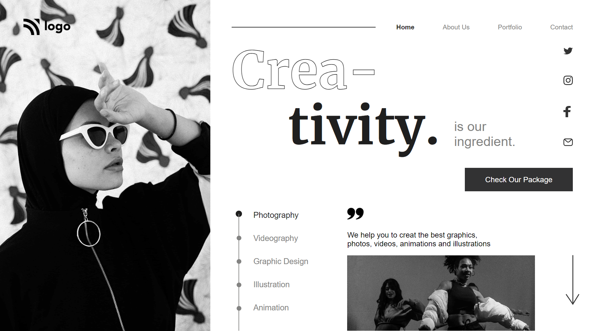

# UI Project 14 - Creative Website

> ### **Deployed Website** :-[Live Link](https://ui-project-14.netlify.app/)
 

## Project key takeaways:

  - Used Only **Html** and **CSS**
  - I used flexbox and media queries to make the section mobile responsive.
  - I learned a lot about flexbox and position combined.
  - Learned to about Background-images and their positions.

   

 

> ## It took around 3.5 hours to complete and make this project **Mobiile** Responsive.
